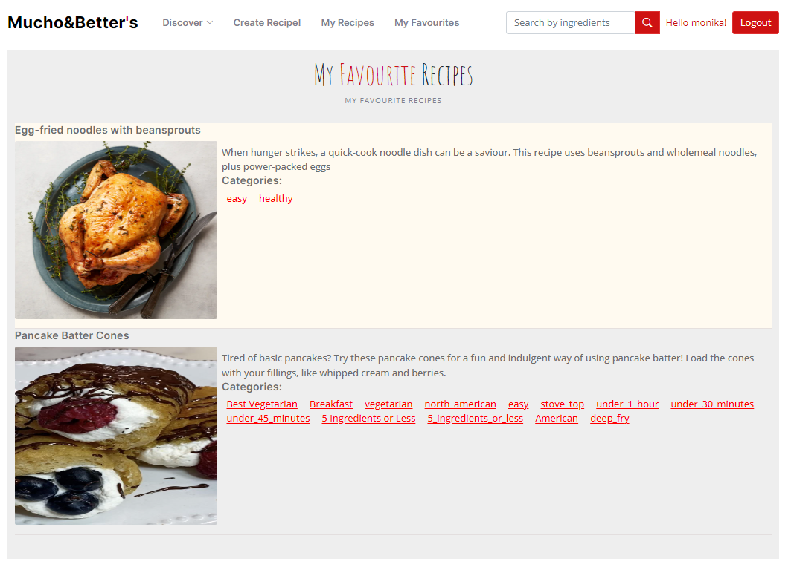

## ASP.NET-Core-Recipes
A simple training ASP.NET Core application that allows its users to browse, create and share food recipes online.

## Built With
* ASP.NET Core (MVC)
* MS SQL
* Entity Framework Core
* Bootstrap
* Vanilla JS

 ## External resources
 ### General:
* Theme: [Yummy-Theme](https://bootstrapmade.com/yummy-bootstrap-restaurant-website-template/)
 ### Resorces for tests
* Images API: [https://pixabay.com](https://pixabay.com/api/docs/#api_search_images)
* Recipes API: [https://rapidapi.com/](https://rapidapi.com/apidojo/api/tasty/)
* Additional recipes from https://www.bbcgoodfood.com/recipes
  
### Overview
* Search by category:

* Create new:

* Edit:

* Add to collections (My Recipes or Favourites):

* Comment section:

